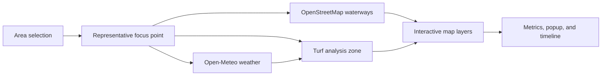

# Albay Flood Monitor

Albay Flood Monitor is a responsive flood-intelligence dashboard for Albay, Philippines. It combines administrative boundaries, weather-model precipitation, nearby waterways, terrain, and a configurable circular analysis zone to help users explore possible rain-driven flood conditions at province, city/municipality, and barangay level.

The dashboard is an exploratory decision-support tool. Its risk score and water-volume estimate are heuristic outputs, not official forecasts, warnings, hydrologic simulations, or evacuation guidance.

## Key features

- Searchable coverage of Albay Province, all 18 cities and municipalities, and 720 barangays.
- Diacritic-insensitive place search with keyboard navigation.
- Administrative-boundary highlighting for the selected province, municipality/city, or barangay.
- Mapbox satellite terrain with 3D relief and an area-focused camera.
- Open-Meteo current conditions and hourly precipitation data.
- A configurable analysis radius from 1 to 20 km.
- Rain-accumulation windows from 1 to 48 hours.
- A playable forecast timeline spanning the weather data returned by the provider.
- Nearby rivers, streams, canals, drains, ditches, riverbanks, and water polygons from OpenStreetMap through the Overpass API.
- A rain-animation layer whose intensity follows the selected hourly rain rate.
- Toggleable boundary, accumulation-zone, rain, waterway, and waterbody layers.
- Automatic weather refresh, stale-data indicators, and limited offline continuity.
- Responsive layouts for desktop, tablet, mobile portrait, and short landscape screens.
- No browser geolocation request; the app starts with Albay Province selected.

## How the dashboard works

Selecting an area highlights its administrative boundary and derives a representative point inside that boundary. The point drives the weather request, nearby-water search, map focus, and circular risk-zone calculation.



For a province or municipality, the analysis represents the configured circular zone around the derived focus point. It does not claim that a single weather reading describes every location inside the full administrative boundary.

## Technology stack

| Layer | Technology | Purpose |
| --- | --- | --- |
| Application | Next.js 14 App Router | UI, metadata, manifest, and weather proxy route |
| Interface | React 18 and TypeScript | Interactive dashboard state and typed components |
| Mapping | Mapbox GL JS 3 | Satellite map, terrain, sources, layers, popups, and controls |
| Geospatial analysis | Turf 7 | Representative points, circular zones, area calculations, and geometry operations |
| Weather | Open-Meteo Forecast API | Current conditions and hourly precipitation |
| Hydrology context | OpenStreetMap Overpass API | Nearby waterways and water polygons |
| Boundary data | PSA PSGC and NAMRIA-derived GeoJSON | Albay province, municipality, and barangay coverage |
| Styling | Global CSS | Responsive layouts, loading states, dialogs, and map overlays |

## Requirements

- Node.js 18.17 or newer.
- npm.
- A public Mapbox access token.
- Network access to Mapbox, Open-Meteo, and the OpenStreetMap Overpass API.

## Local setup

1. Clone the repository and enter the project directory.

   ```bash
   git clone <repository-url>
   cd flood-map
   ```

2. Install dependencies.

   ```bash
   npm install
   ```

3. Create `.env.local` in the project root.

   ```dotenv
   NEXT_PUBLIC_MAPBOX_TOKEN=pk_your_public_mapbox_token
   NEXT_PUBLIC_SITE_URL=http://localhost:3000
   ```

   `NEXT_PUBLIC_MAPBOX_TOKEN` is required. `NEXT_PUBLIC_SITE_URL` is optional locally and is used for absolute metadata URLs. Because variables prefixed with `NEXT_PUBLIC_` are included in browser code, use a public Mapbox token and restrict its allowed URLs in your Mapbox account.

4. Start the development server.

   ```bash
   npm run dev
   ```

5. Open [http://localhost:3000](http://localhost:3000).

## Environment variables

| Variable | Required | Description |
| --- | --- | --- |
| `NEXT_PUBLIC_MAPBOX_TOKEN` | Yes | Public Mapbox token used by Mapbox GL JS in the browser. |
| `NEXT_PUBLIC_SITE_URL` | No | Canonical application origin used by Next.js metadata, for example `https://flood.example.org`. |
| `VERCEL_PROJECT_PRODUCTION_URL` | Automatic on Vercel | Used as the metadata origin when `NEXT_PUBLIC_SITE_URL` is absent. |

The app falls back to `http://localhost:3000` for metadata when neither site URL variable is available.

## Available scripts

| Command | Description |
| --- | --- |
| `npm run dev` | Start the Next.js development server. |
| `npm run build` | Create an optimized production build and run Next.js build-time checks. |
| `npm run start` | Serve the completed production build. |
| `npm run lint` | Start Next.js's ESLint setup; the repository does not yet include an ESLint configuration. |

## Using the application

### Select an area

Open the area picker and search for Albay Province, a city or municipality, or a barangay. Matching ignores letter case and diacritical marks. The result list is capped at 100 items to keep the picker responsive.

The picker supports the following keyboard controls:

- `Arrow Up` and `Arrow Down` move through results.
- `Enter` selects the highlighted result.
- `Escape` closes the dialog and returns focus to the picker button.

Changing the area updates the highlighted boundary, representative focus point, map camera, weather analysis, and nearby-water request.

### Configure the analysis

- **Analysis radius:** sets the radius of the circular catchment-style zone from 1 to 20 km.
- **Rain accumulation window:** sums precipitation over the selected trailing period from 1 to 48 hours.
- **Timeline:** chooses the forecast hour used as the end of the accumulation window.
- **Play:** advances the selected forecast hour automatically.
- **Reset view:** restores the map camera to the currently selected area.

### Control GIS layers

The layer controls show or hide:

- Barangay boundaries.
- Rain-accumulation and risk zone.
- Animated rain dots.
- Rivers and streams.
- Waterbody polygons.

On compact screens, the legend collapses so the map and controls remain usable without covering most of the viewport.

## Metrics and calculations

### Rain accumulation

The app sums available hourly precipitation values over the selected trailing window. When the selected hour is the current weather interval, the current precipitation value is normalized to millimeters per hour using the interval supplied by Open-Meteo.

### Analysis area

Turf creates an 80-step circle around the selected focus point. The displayed catchment area is the geodesic area of this polygon, converted from square meters to square kilometers.

### Estimated water in zone

The estimated volume assumes the accumulated rain falls uniformly across the analysis zone:

```text
estimated water (liters) = analysis area (m²) × accumulated rain (mm)
```

This works because 1 mm of rain over 1 m² equals 1 liter of water. The number is gross rainfall volume only; it does not account for infiltration, drainage capacity, evaporation, soil saturation, surface roughness, buildings, pumps, tides, river discharge, or upstream flow.

### Risk index

The 0–100 risk index combines:

- Average hourly precipitation over the selected window.
- Rain intensity at the selected forecast hour.
- Total accumulated precipitation.
- A modest low-elevation penalty from the weather model's reported elevation.

The map uses these display bands:

| Score | Color | Dashboard interpretation |
| --- | --- | --- |
| 0–29 | Green | Lower modeled rain-driven risk |
| 30–49 | Amber | Elevated modeled risk |
| 50–69 | Orange | High modeled risk |
| 70–100 | Red | Very high modeled risk |

These bands are application heuristics. They are not PAGASA rainfall-warning thresholds and must not be interpreted as official hazard classifications.

## Data sources and attribution

### Administrative boundaries

Barangay and municipality names follow the [Philippine Statistics Authority PSGC register](https://psa.gov.ph/classification/psgc/). The bundled Albay GeoJSON is derived from PSA/NAMRIA administrative-boundary data and simplified for web mapping through the [Barangay Boundaries Repository](https://github.com/bendlikeabamboo/barangay-boundaries-repository), release `v2026.4.13.0`.

Bundled dataset metadata:

- Province code: `05005`.
- PSGC snapshot: `2023-10-24`.
- NAMRIA boundary version: `2023-11-06`.
- Feature count: 720 barangays.

Each feature in `public/albay-barangays.geojson` includes properties shaped like this:

```json
{
  "code": "PSGC barangay code",
  "name": "Barangay name",
  "areaSqKm": 0,
  "municipalityCode": "PSGC city or municipality code",
  "municipalityName": "City or municipality name",
  "provinceCode": "05005",
  "provinceName": "Albay"
}
```

### Weather

The server route at `GET /api/weather` proxies the [Open-Meteo Forecast API](https://open-meteo.com/en/docs). It requests current temperature, current precipitation, weather code, and hourly precipitation with two past days and three forecast days in the location's automatically selected timezone.

Example request:

```bash
curl "http://localhost:3000/api/weather?latitude=13.15079&longitude=123.72841"
```

Weather responses are cached for five minutes and may be served stale for an additional minute while revalidation occurs. The client refreshes periodically, refreshes when the selected area changes or connectivity returns, and labels old observations as stale.

### Waterways and waterbodies

The browser sends a location-and-radius query to the [OpenStreetMap Overpass API](https://overpass-api.de/) for nearby waterways and natural-water features. These layers provide geographic context only. Completeness and geometry accuracy depend on current OpenStreetMap coverage and Overpass availability.

### Basemap and terrain

Mapbox provides the standard satellite basemap, terrain elevation tiles, and map controls. Mapbox attribution remains visible through the map renderer.

## Application architecture

```text
flood-map/
├── app/
│   ├── api/weather/route.ts     # Validated and cached Open-Meteo proxy
│   ├── globals.css              # Application and responsive styling
│   ├── layout.tsx               # Metadata, viewport, and global layout
│   ├── manifest.ts              # Web-app manifest
│   ├── opengraph-image.tsx      # Generated social preview image
│   ├── page.tsx                 # Main route
│   └── twitter-image.tsx        # Generated Twitter/X preview image
├── components/
│   ├── FloodLoadingIcon.tsx     # Loading-stage icon
│   └── FloodMap.tsx             # Map, controls, search, data, and analysis
├── public/
│   ├── albay-barangays.geojson  # Province-wide administrative boundaries
│   └── logo.svg                 # Public application logo
├── declarations.d.ts            # Module and asset declarations
├── next.config.js               # Next.js configuration
├── package.json                 # Scripts and dependencies
└── tsconfig.json                # TypeScript configuration
```

### Request flow

1. `FloodMap` loads the bundled Albay boundary GeoJSON.
2. The selected boundary is reduced to a representative focus point.
3. The client calls `/api/weather` with that point's latitude and longitude.
4. The server validates the coordinates and requests Open-Meteo data.
5. The client queries Overpass for water features near the same point.
6. Turf builds the analysis polygon and calculates its area.
7. React derives rain, volume, and risk metrics and updates Mapbox sources and layers.

## API behavior

`GET /api/weather` accepts the following query parameters:

| Parameter | Required | Validation |
| --- | --- | --- |
| `latitude` | Yes | Finite number from -90 to 90. |
| `longitude` | Yes | Finite number from -180 to 180. |

Possible responses:

- `200`: Open-Meteo response body.
- `400`: Missing or invalid coordinates.
- `502`: Weather provider request failed or returned an unusable response.

Successful responses include cache headers and an `X-Weather-Source: open-meteo` header.

## Responsive and accessibility behavior

- Large screens use a multi-column dashboard with controls, map, and readings.
- Tablet and portrait mobile layouts stack the interface into one column.
- Short landscape mobile screens use a compact two-column arrangement.
- The area picker becomes a full-screen dialog on narrow devices.
- Controls and metric values shrink or reflow to prevent horizontal overflow.
- Search results expose active-option state and support keyboard-only selection.
- Interactive controls have accessible labels and focus restoration.
- Rain animation respects the user's `prefers-reduced-motion` setting.

## Loading, caching, and offline behavior

The initial overlay reports progress for area data, weather, 3D map setup, and GIS layers. Weather has explicit loading, live, stale, offline, and error states.

- The server caches weather responses for 300 seconds.
- The client schedules a weather refresh every five minutes.
- Data older than twelve minutes is considered stale.
- Previously loaded weather can remain visible during a temporary network outage.
- Hydrology requests are debounced after location or radius changes.
- Overpass timeouts or rate limits can temporarily leave water layers unavailable without preventing the rest of the dashboard from working.

The app does not provide a complete offline map or offline-first installation because its basemap, terrain, weather, and hydrology layers depend on third-party network services.

## Privacy and network requests

- The app does not request browser geolocation.
- There is no account system, user profile, or persistent application database.
- Selecting an area sends its representative coordinates to the local weather route, which forwards them to Open-Meteo.
- The browser sends the focus coordinates and search radius to the public Overpass endpoint.
- Mapbox receives normal browser requests required to load its map style and terrain tiles.

Review the policies and operational requirements of these providers before using the application in a production or regulated environment.

## Limitations and safety notice

- This is not a hydrodynamic or drainage-network model.
- Rain is assumed to be spatially uniform across the circular analysis zone.
- The estimated water volume does not represent ponding depth or runoff volume.
- Elevation is a coarse model input and is not a parcel-level ground survey.
- Administrative boundaries are simplified for web display.
- Water-feature availability depends on volunteered OpenStreetMap data.
- Weather forecasts and observations can change, be delayed, or be unavailable.
- The dashboard does not include river gauges, tide levels, dam releases, storm surge, soil moisture, drainage capacity, or official hazard maps.

For real-world safety decisions, follow PAGASA bulletins and instructions from Albay provincial, city/municipal, barangay, and disaster-risk-reduction authorities.

## Production build and deployment

Create and serve a local production build:

```bash
npm run build
npm run start
```

For deployment platforms such as Vercel:

1. Add `NEXT_PUBLIC_MAPBOX_TOKEN` to the production environment.
2. Set `NEXT_PUBLIC_SITE_URL` to the canonical HTTPS origin when possible.
3. Restrict the Mapbox token to the deployed origin and any approved preview origins.
4. Confirm the deployment can reach `api.open-meteo.com`.
5. Confirm client browsers can reach Mapbox and `overpass-api.de` under the site's Content Security Policy.
6. Run `npm run build` before release.

No server-side database, migration, or seed step is required.

## Troubleshooting

### The map shows a missing-token error

Confirm `.env.local` contains `NEXT_PUBLIC_MAPBOX_TOKEN`, then restart the development server. Next.js reads environment variables when the process starts.

### The basemap is blank or reports authorization errors

Check that the Mapbox token is valid, public, and permitted for the current origin. Also check browser developer tools for blocked style, sprite, glyph, or terrain requests.

### Weather does not load

Open `/api/weather` with valid coordinates and inspect the response. A `400` indicates invalid input; a `502` normally indicates an upstream connectivity or provider error.

### Waterways take a long time to appear

Overpass is a shared public service and may be busy or rate limited. Reduce the analysis radius, wait briefly, and retry by changing the selected area or radius.

### Area search has no results

Search by province, city/municipality, or barangay name. If the development console reports a boundary-loading error, confirm `public/albay-barangays.geojson` is present and served successfully.

### Layout issues appear only on mobile

Test both portrait and landscape orientation, close the full-screen area picker, and verify the browser is honoring the device-width viewport. The app has separate compact rules for narrow portrait and short landscape viewports.

## Validation and testing

At minimum, run the production build before submitting changes:

```bash
npm run build
```

There is currently no automated test suite or committed ESLint configuration. The production build still performs TypeScript and Next.js build-time checks. A useful manual smoke test covers:

- Province, municipality, and barangay search and selection.
- Keyboard navigation and dialog dismissal.
- Radius and rain-window controls at their minimum and maximum values.
- Timeline playback and current-hour selection.
- GIS layer visibility toggles.
- Weather refresh, stale state, and temporary offline behavior.
- Desktop, narrow portrait, and short landscape layouts.
- Map reset and area-boundary camera fitting.

## Contributing

Keep changes focused and preserve the distinction between modeled indicators and official flood guidance. Before opening a pull request:

1. Install dependencies with `npm install`.
2. Make the change in a dedicated branch.
3. Run `npm run build`.
4. Complete the relevant manual smoke tests.
5. Document new environment variables, third-party services, calculations, or data-source changes here.

Do not commit `.env.local`, private tokens, or provider credentials.

## License

This project is released under the [MIT License](LICENSE). Third-party data and services remain subject to their own licenses and terms.
