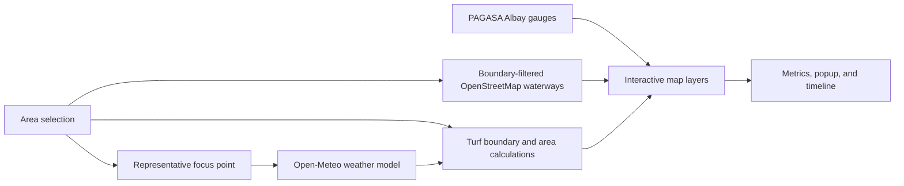

# Albay Flood Monitor

Albay Flood Monitor is a responsive rainfall and GIS context dashboard for Albay, Philippines. It combines official PAGASA rain-gauge observations, numerical weather-model output, administrative boundaries, volunteered nearby-water features, terrain, and a boundary-clipped land-area analysis zone.

Every displayed data value is either returned by a named provider or transparently calculated from those provider values. The app does not generate a flood-risk score, use mock fallbacks, or present animated rain particles as observations. It is not an official forecast, warning, hydrologic simulation, or evacuation-guidance service.

## Key features

- Searchable coverage of Albay Province, all 18 cities/municipalities, and 720 barangays, validated against the official PSA count.
- Diacritic-insensitive place search with keyboard navigation.
- Administrative-boundary highlighting for the selected province, municipality/city, or barangay.
- Viewport-aware map navigation constrained to a padded Albay boundary on desktop and smaller devices.
- Mapbox satellite terrain with 3D relief and an area-focused camera.
- Open-Meteo current conditions and hourly precipitation data.
- Current, station-specific hourly rain observations from DOST-PAGASA gauges in Albay, with source timestamps and stale/unavailable states.
- Boundary-derived land-area coverage for Albay Province and every selected city, municipality, or barangay.
- Rain-accumulation windows from 1 to 48 hours.
- A playable forecast timeline spanning the weather data returned by the provider, with selectable 1×–4× playback speed.
- Nearby rivers, streams, canals, drains, ditches, riverbanks, reservoirs, basins, and simple or multipolygon waterbodies from OpenStreetMap.
- A rain-animation layer whose intensity follows the selected hourly rain rate.
- Toggleable accumulation-zone, rain, waterway, and waterbody layers.
- Automatic weather refresh, provider timestamps, stale-data indicators, and limited offline continuity.
- Visible source, vintage, and limitation labels for weather, boundaries, waterways, and official PAGASA guidance.
- A collapsible desktop readings rail that returns its width to the map while keeping an edge-mounted restore control.
- Runtime validation of weather provenance and every boundary feature before data are displayed.
- Responsive layouts for desktop, tablet, mobile portrait, and short landscape screens.
- On-demand, high-accuracy device location for flood reports, with fresh-fix checks, visible uncertainty, and manual pin correction.

## How the dashboard works

Selecting an area highlights its administrative boundary and derives a representative point inside that boundary. The point drives the weather request and map focus. Turf dissolves the selected barangay geometries into one authoritative land boundary used by the rain zone, animation clipping, area calculation, gross rainfall volume, and hydrology filtering.



For every administrative level, the displayed rainfall is a representative-point model value applied uniformly to the complete selected land boundary. It does not claim that one weather-model grid point measures conditions at every location inside that boundary.

## Technology stack

| Layer | Technology | Purpose |
| --- | --- | --- |
| Application | Next.js 14 App Router | UI, metadata, manifest, and weather proxy route |
| Interface | React 18 and TypeScript | Interactive dashboard state and typed components |
| Mapping | Mapbox GL JS 3 | Satellite map, terrain, sources, layers, popups, and controls |
| Geospatial analysis | Turf 7 | Representative points, dissolved land boundaries, area calculations, and geometry operations |
| Weather | Open-Meteo Forecast API | Current conditions and hourly precipitation |
| Observed rainfall | DOST-PAGASA Automated Rain Gauges | Station-specific preceding-hour measurements |
| Hydrology context | OpenStreetMap API and Overpass API | Validated nearby waterways and waterbody polygons |
| Boundary data | PSA PSGC names/codes and NAMRIA-derived GeoJSON | Validated Albay province, municipality, and barangay coverage |
| Styling | Global CSS | Responsive layouts, loading states, dialogs, and map overlays |

## Requirements

- Node.js 18.17 or newer.
- npm.
- A public Mapbox access token.
- A Firebase project with a registered Web app, Cloud Firestore, and Anonymous Authentication enabled.
- Network access to Mapbox, Open-Meteo, DOST-PAGASA, OpenStreetMap, and the Overpass API.

## Local setup

1. Clone the repository and enter the project directory.

   ```bash
   git clone <repository-url>
   cd flood-map
   ```

2. Install dependencies.

   ```bash
   npm install
   ```

3. Create `.env.local` in the project root.

   ```dotenv
   NEXT_PUBLIC_MAPBOX_TOKEN=pk_your_public_mapbox_token
   NEXT_PUBLIC_SITE_URL=http://localhost:3000
   NEXT_PUBLIC_FIREBASE_API_KEY=your_firebase_web_api_key
   NEXT_PUBLIC_FIREBASE_AUTH_DOMAIN=your-project.firebaseapp.com
   NEXT_PUBLIC_FIREBASE_PROJECT_ID=your-project-id
   NEXT_PUBLIC_FIREBASE_STORAGE_BUCKET=your-project.firebasestorage.app
   NEXT_PUBLIC_FIREBASE_MESSAGING_SENDER_ID=your_sender_id
   NEXT_PUBLIC_FIREBASE_APP_ID=your_web_app_id
   ```

   `NEXT_PUBLIC_MAPBOX_TOKEN` is required. `NEXT_PUBLIC_SITE_URL` is optional locally and is used for absolute metadata URLs. Because variables prefixed with `NEXT_PUBLIC_` are included in browser code, use a public Mapbox token and restrict its allowed URLs in your Mapbox account.

4. Enable end-user account creation in **Firebase Console → Authentication → Settings → User actions**, then deploy Anonymous Authentication and the Firestore rules from this repository while signed into an account that can administer the Firebase project.

   ```bash
   npx firebase-tools deploy --only auth,firestore:rules --project your-project-id
   ```

5. Start the development server.

   ```bash
   npm run dev
   ```

6. Open [http://localhost:3000](http://localhost:3000).

## Environment variables

| Variable | Required | Description |
| --- | --- | --- |
| `NEXT_PUBLIC_MAPBOX_TOKEN` | Yes | Public Mapbox token used by Mapbox GL JS in the browser. |
| `NEXT_PUBLIC_SITE_URL` | No | Canonical application origin used by Next.js metadata, for example `https://flood.example.org`. |
| `NEXT_PUBLIC_FIREBASE_API_KEY` | For reporting | Public Firebase Web API key. |
| `NEXT_PUBLIC_FIREBASE_AUTH_DOMAIN` | For reporting | Firebase Authentication domain. |
| `NEXT_PUBLIC_FIREBASE_PROJECT_ID` | For reporting | Firebase project ID used by Firestore. |
| `NEXT_PUBLIC_FIREBASE_STORAGE_BUCKET` | For reporting | Firebase Web app storage bucket value. |
| `NEXT_PUBLIC_FIREBASE_MESSAGING_SENDER_ID` | For reporting | Firebase Cloud Messaging sender ID from the Web app configuration. |
| `NEXT_PUBLIC_FIREBASE_APP_ID` | For reporting | Firebase Web app identifier. |
| `VERCEL_PROJECT_PRODUCTION_URL` | Automatic on Vercel | Used as the metadata origin when `NEXT_PUBLIC_SITE_URL` is absent. |

The app falls back to `http://localhost:3000` for metadata when neither site URL variable is available.

## Available scripts

| Command | Description |
| --- | --- |
| `npm run dev` | Start the Next.js development server. |
| `npm run validate:data` | Verify the boundary artifact hash, provenance, geometry, codes, and official Albay coverage. |
| `npm run build` | Create an optimized production build and run Next.js build-time checks. |
| `npm run start` | Serve the completed production build. |
| `npm run lint` | Start Next.js's ESLint setup; the repository does not yet include an ESLint configuration. |

## Using the application

### Report flooding

Select **Report flood** on the map to begin. The app requests device location only at that point; it never requests location during ordinary map browsing. It ignores cached readings and briefly watches for improving GPS fixes instead of accepting the first coarse result. The map shows the device-reported accuracy radius and exact accuracy estimate; retry GPS or adjust the pin when the reading is imprecise. If access is denied, unavailable, or still less accurate than 250 meters, place the report manually by tapping the map. Choose a water depth and vehicle-access level, then submit.

Community reports are stored in Cloud Firestore and shown on the map for 24 hours. Submission uses Firebase Anonymous Authentication, so no visible account setup is required. Deploy the included `firestore.rules` before accepting reports; the rules allow public reads, permit only validated anonymous creates, and deny client updates or deletes.

### Select an area

Open the area picker and search for Albay Province, a city or municipality, or a barangay. Matching ignores letter case and diacritical marks. The result list is capped at 100 items to keep the picker responsive.

The picker supports the following keyboard controls:

- `Arrow Up` and `Arrow Down` move through results.
- `Enter` selects the highlighted result.
- `Escape` closes the dialog and returns focus to the picker button.

Changing the area updates the highlighted boundary, representative focus point, map camera, weather analysis, and nearby-water request.

### Configure the analysis

- **Rainfall coverage:** uses the complete land boundary of the selected province, city/municipality, or barangay. The boundary determines the animation clip, land area, and gross rainfall volume.
- **Rain accumulation window:** sums precipitation over the selected trailing period from 1 to 48 hours.
- **Timeline:** chooses the forecast hour used as the end of the accumulation window.
- **Play:** advances the selected forecast hour automatically.
- **Reset view:** restores the map camera to the currently selected area.

On compact screens, the Analysis Controls container can be collapsed from its header and the map expands into the released space. The controls remain open on larger screens. Map-interpretation caveats and current hydrology counts are available from the PAGASA exclamation dialog.

### Control GIS layers

The layer controls show or hide:

- Barangay boundaries.
- Entire Albay Province land perimeter, drawn as one solid red cartographic outline with no interior fill or barangay seams; barangay selection does not change this outline.
- Animated rain dots.
- Rivers and streams.
- Waterbody polygons.

The rain-rate animation is clipped to the complete selected boundary at every administrative level, including multi-part geometries and holes. Particle locations, density, size, and motion are illustrative; only the displayed millimeter-per-hour and wind values come from the weather provider.

On compact screens, the legend collapses so the map and controls remain usable without covering most of the viewport.

## Metrics and calculations

### Rain accumulation

Open-Meteo defines hourly precipitation as the total for the preceding hour. The app sums those hourly totals over the selected trailing window and displays the true coverage start one hour before the first included timestamp. For the current selection, the provider's current interval precipitation—normally a preceding 15-minute modeled total—is normalized to an equivalent average rate in millimeters per hour.

These values are weather-model outputs, not rain-gauge measurements. Fifteen-minute data in regions without native high-resolution model coverage may be interpolated from hourly data.

### Official station observations

The measured-rain card and PAGASA station rows come from the public [DOST-PAGASA Latest Automated Rain Gauges](https://bagong.pagasa.dost.gov.ph/automated-rain-gauge) table. The server extracts only rows whose published station name identifies Albay; it does not contain a hardcoded rainfall value or synthesize a replacement when PAGASA reports `-`.

Each observation retains its PAGASA site ID, station name, elevation, preceding-hour rainfall, and Philippine-time observation timestamp. A numeric observation more than 60 minutes old is labeled stale. A missing value stays unavailable. These sparse, point-based gauge readings are shown as an independent ground check and are never substituted into the selected boundary model calculations.

### Selected land area

Turf dissolves the administrative polygons for the current selection and calculates the geodesic area of the resulting `Polygon` or `MultiPolygon`. The displayed square-kilometer value, rain-animation clip, and gross-volume calculation share that selected geometry. The solid red map perimeter is a separate province-scale display artifact: mainland Albay and Rapu-Rapu are buffered and dissolved independently, only their exterior rings are retained, and Rapu-Rapu's island chain is kept inside one continuous outline. This removes internal rings and barangay seams. Neither geometry is a surveyed hydrologic catchment.

### Gross rainfall volume

The estimated volume assumes the accumulated rain falls uniformly across the selected land boundary:

```text
estimated water (liters) = selected land area (m²) × accumulated rain (mm)
```

This works because 1 mm of rain over 1 m² equals 1 liter of water. The number is gross rainfall volume only; it does not account for infiltration, drainage capacity, evaporation, soil saturation, surface roughness, buildings, pumps, tides, river discharge, or upstream flow.

## Data sources and attribution

### Administrative boundaries

Barangay and municipality names follow the [Philippine Statistics Authority PSGC register](https://psa.gov.ph/classification/psgc/). The bundled Albay GeoJSON is derived from PSA/NAMRIA administrative-boundary data and simplified for web mapping through the [Barangay Boundaries Repository](https://github.com/bendlikeabamboo/barangay-boundaries-repository), release `v2026.4.13.0`.

The [official PSA Albay entry](https://psa.gov.ph/classification/psgc/citimuni/0500500000) was cross-checked against the current PSGC publication as of 30 June 2026. It confirms 3 cities, 15 municipalities, and 720 barangays. This current count check does not change the disclosed vintage of the bundled names or geometry.

Bundled dataset metadata:

- Province code: `05005`.
- PSGC snapshot: `2023-10-24`.
- NAMRIA boundary version: `2023-11-06`.
- Feature count: 720 barangays.

Each feature in `public/albay-barangays.geojson` includes source properties. This is an actual Baclayon record, not placeholder data:

```json
{
  "code": "0500501001",
  "name": "Baclayon",
  "areaSqKm": 1.29169119012,
  "municipalityCode": "0500501000",
  "municipalityName": "Bacacay",
  "provinceCode": "05005",
  "provinceName": "Albay"
}
```

The app validates all 720 unique barangay codes, geometry types, required properties, province codes, metadata, and the 18-LGU grouping before displaying the dataset. Displayed boundary areas are recalculated geodesically from the bundled visible geometry with Turf rather than trusting the pre-simplification `areaSqKm` property.

The unused legacy `public/legazpi-barangays.geojson` extract is also covered by the audit: its 70 features must exactly match the corresponding PSGC codes, names, areas, and geometries in the validated province dataset.

### Weather

The server route at `GET /api/weather` proxies the [Open-Meteo Forecast API](https://open-meteo.com/en/docs). Open-Meteo combines output from national weather-service models and selects a best-match model for the coordinate. The route requests current temperature, precipitation, WMO weather code, 10 m wind, and hourly values with two past days and three forecast days in the location's automatically selected timezone. Millimeters, kilometers per hour, ISO 8601 local timestamps, best-match model selection, and land-cell selection are requested explicitly.

Example request:

```bash
curl "http://localhost:3000/api/weather?latitude=13.15079&longitude=123.72841"
```

The server rejects incomplete provider payloads and adds a `_provenance` object naming the provider, documentation URL, dataset type, route-served time, and requested coordinates. The browser independently validates arrays, units, timestamps, coordinate metadata, and provenance before display. Responses are cached for five minutes and may be served stale for one additional minute while revalidation occurs. Old model data are labeled stale.

### Official rain gauges

`GET /api/rainfall-observations` retrieves PAGASA's current automated-rain-gauge publication on the server, validates its table structure and values, converts Philippine local timestamps to explicit `+08:00` ISO timestamps, and returns only Albay stations. The upstream result is cached for two minutes. If PAGASA is unavailable or changes the table incompatibly, the route does not fabricate a replacement; every retained value still carries its source observation time and becomes visibly stale.

### Waterways and waterbodies

The browser calls the local `GET /api/hydrology` route with the selected administrative level and PSA code. The server resolves that code only against the bundled, validated Albay boundary dataset, queries the selected boundary's complete bounding box, and retains every returned feature that spatially intersects the province, municipality, or barangay boundary. Hydrology and rainfall coverage therefore use the same complete administrative area. One Overpass query contains flowing waterways, simple waterbody ways, and multipolygon waterbody relations, keeping every successful response category-complete. It tries the documented main, VK Maps, and Private.coffee global instances; if no provider supplies a complete validated response, the route returns an error instead of silently shrinking the selected area or fabricating data.

The converter joins relation-member segments into closed outer and inner rings, assigns holes to their containing outer polygon, and returns valid GeoJSON `LineString`, `Polygon`, or `MultiPolygon` features. Supported flowing-water tags are river, stream, canal, drain, ditch, and tidal channel. Supported waterbody tags include `natural=water`, riverbanks, reservoirs, and basins. Returned features retain their OpenStreetMap object type, ID, version, last-edit timestamp, and direct source URL. The server rejects unrecognized source attribution, malformed object metadata or geometry, future timestamps, and Overpass snapshots more than six hours behind the live database. The browser independently validates identity, version, edit time, feature/geometry class, counts, selected scope/code/bounds, spatial intersection, allowed upstream host, response age, and the server's source-validation result before Mapbox receives the data.

These volunteered layers provide geographic context only; they are not official hydrology, flood extents, drainage capacity, or evidence that a feature is currently flowing. Counts represent OSM way/relation features intersecting the selected boundary, not a count of uniquely named river systems. Completeness and geometry accuracy depend on OpenStreetMap coverage and upstream availability. Data attribution is [© OpenStreetMap contributors, ODbL](https://www.openstreetmap.org/copyright).

### Basemap and terrain

Mapbox provides the standard satellite basemap, terrain elevation tiles, and map controls. Mapbox attribution remains visible through the map renderer.

## Application architecture

```text
flood-map/
├── app/
│   ├── api/weather/route.ts     # Validated and cached Open-Meteo proxy
│   ├── api/rainfall-observations/route.ts # Validated PAGASA gauge proxy
│   ├── api/hydrology/route.ts   # Validated OSM retrieval and availability routing
│   ├── globals.css              # Application and responsive styling
│   ├── layout.tsx               # Metadata, viewport, and global layout
│   ├── manifest.ts              # Web-app manifest
│   ├── opengraph-image.tsx      # Generated social preview image
│   ├── page.tsx                 # Main route
│   └── twitter-image.tsx        # Generated Twitter/X preview image
├── components/
│   ├── FloodLoadingIcon.tsx     # Loading-stage icon
│   └── FloodMap.tsx             # Map, controls, search, data, and analysis
├── lib/
│   ├── dataSources.ts            # Provider URLs, vintages, and verified coverage
│   ├── osmHydrology.ts            # OSM normalization and GeoJSON relation conversion
│   └── pagasaRainfall.ts         # PAGASA table parser, validation, and freshness rules
├── public/
│   ├── albay-barangays.geojson  # Province-wide administrative boundaries
│   └── logo.svg                 # Public application logo
├── scripts/
│   └── validate-data.mjs        # Deterministic boundary integrity audit
├── declarations.d.ts            # Module and asset declarations
├── next.config.js               # Next.js configuration
├── package.json                 # Scripts and dependencies
└── tsconfig.json                # TypeScript configuration
```

### Request flow

1. `FloodMap` loads the bundled Albay boundary GeoJSON.
2. The selected boundary is reduced to a representative focus point.
3. The client calls `/api/weather` with that point's latitude and longitude.
4. The server validates the coordinates and requests Open-Meteo data.
5. Independently, the server retrieves current Albay station observations from PAGASA.
6. The client calls `/api/hydrology` with the selected administrative scope/code; the server retrieves, normalizes, validates, and boundary-filters OpenStreetMap water features.
7. Turf dissolves the selected administrative polygons and calculates their land area.
8. React applies the model totals to that boundary for the rain zone and gross rainfall volume, while keeping PAGASA measurements visibly separate.

## API behavior

`GET /api/weather` accepts the following query parameters:

| Parameter | Required | Validation |
| --- | --- | --- |
| `latitude` | Yes | Finite number from -90 to 90. |
| `longitude` | Yes | Finite number from -180 to 180. |

Possible responses:

- `200`: validated Open-Meteo response plus `_provenance` metadata.
- `400`: Missing or invalid coordinates.
- `502`: Weather provider request failed or returned an unusable response.

Successful responses include cache headers, `X-Weather-Source: Open-Meteo Forecast API`, and `X-Data-Provenance` headers.

`GET /api/rainfall-observations` takes no parameters. A successful response contains validated Albay station observations and `X-Rainfall-Source: DOST-PAGASA Automated Rain Gauges`; an upstream, parsing, or validation failure returns `502`.

`GET /api/hydrology` requires `scope=province|municipality|barangay` and the matching Albay PSA `code`. A successful response contains boundary-filtered GeoJSON, per-class feature counts, the selected scope/code and trusted boundary provenance, source hosts, query bounds, OSM dataset timestamp, freshness validation, and completeness states for waterway lines, simple waterbodies, and relation waterbodies. Shared HTTP caches reuse a response for ten minutes. The browser also persists up to six selected-area responses for six hours and skips a network request when a complete entry is under ten minutes old. Invalid or non-Albay selections return `400`; complete upstream failure returns `502` without reducing the selected area.

## Responsive and accessibility behavior

- Large screens use a multi-column dashboard with a collapsible readings rail.
- Tablet and portrait mobile layouts stack the interface into one column.
- Short landscape mobile screens use a compact two-column arrangement.
- Compact screens can collapse Analysis Controls to give the released height or width back to the map.
- The area picker becomes a full-screen dialog on narrow devices.
- Controls and metric values shrink or reflow to prevent horizontal overflow.
- Search results expose active-option state and support keyboard-only selection.
- Interactive controls have accessible labels and focus restoration.
- Rain animation respects the user's `prefers-reduced-motion` setting.

## Loading, caching, and offline behavior

The initial overlay reports progress for area data, weather, 3D map setup, and GIS layers. Weather has explicit loading, current-model, stale, offline, and error states.

- The server caches weather responses for 300 seconds.
- The server caches PAGASA gauge responses for 120 seconds; the client refreshes them every five minutes and on reconnection.
- The client schedules a weather refresh every five minutes.
- Data older than twelve minutes is considered stale.
- Previously loaded weather can remain visible during a temporary network outage.
- Hydrology requests are debounced after administrative-area changes; the same selection also updates rainfall coverage.
- Hydrology responses use a ten-minute browser/shared HTTP cache. The client also keeps the six most recent exact province/municipality/barangay responses in local storage. A validated response under ten minutes old renders immediately and skips the request; an older response can remain visible for up to six hours while a background refresh runs. Cached data must pass the same identity, geometry, selected-area provenance, boundary-intersection, and snapshot-age validation as a network response, and invalid or expired entries are deleted.
- A single selected-boundary query, three documented Overpass providers, strict freshness checks, and no silent area reduction prevent an overloaded or stale mirror from being presented as complete current data.

The app does not provide a complete offline map or offline-first installation because its basemap, terrain, weather, and hydrology layers depend on third-party network services.

## Privacy and network requests

- The app requests browser geolocation only after the user selects **Report flood**. It does not retain location unless the user submits the report.
- There is no account system, user profile, or persistent application database.
- The browser stores up to six validated hydrology responses locally to speed up repeat visits; these entries contain public OSM geometry and the selected focus coordinates and expire automatically.
- Selecting an area sends its representative coordinates to the local weather route, which forwards them to Open-Meteo.
- The browser sends only the selected administrative scope and PSA code to the local hydrology route; the server resolves its boundary and contacts OpenStreetMap/Overpass.
- Mapbox receives normal browser requests required to load its map style and terrain tiles.

Review the policies and operational requirements of these providers before using the application in a production or regulated environment.

## Limitations and safety notice

- This is not a hydrodynamic or drainage-network model.
- Rain is assumed to be spatially uniform across the complete selected land boundary.
- The estimated water volume does not represent ponding depth or runoff volume.
- Elevation is a coarse model input and is not a parcel-level ground survey.
- Administrative boundaries are simplified for web display.
- Water-feature availability depends on volunteered OpenStreetMap data.
- Weather-model outputs can change, be delayed, be interpolated, or be unavailable.
- The dashboard does not include river gauges, tide levels, dam releases, storm surge, soil moisture, drainage capacity, or official hazard maps.

For real-world safety decisions, follow PAGASA bulletins and instructions from Albay provincial, city/municipal, barangay, and disaster-risk-reduction authorities.

## Production build and deployment

Create and serve a local production build:

```bash
npm run build
npm run start
```

For deployment platforms such as Vercel:

1. Add `NEXT_PUBLIC_MAPBOX_TOKEN` to the production environment.
2. Set `NEXT_PUBLIC_SITE_URL` to the canonical HTTPS origin when possible.
3. Restrict the Mapbox token to the deployed origin and any approved preview origins.
4. Confirm the deployment can reach `api.open-meteo.com`.
5. Confirm client browsers can reach Mapbox and `overpass-api.de` under the site's Content Security Policy.
6. Run `npm run build` before release.

No server-side database, migration, or seed step is required.

## Troubleshooting

### The map shows a missing-token error

Confirm `.env.local` contains `NEXT_PUBLIC_MAPBOX_TOKEN`, then restart the development server. Next.js reads environment variables when the process starts.

### The basemap is blank or reports authorization errors

Check that the Mapbox token is valid, public, and permitted for the current origin. Also check browser developer tools for blocked style, sprite, glyph, or terrain requests.

### Weather does not load

Open `/api/weather` with valid coordinates and inspect the response. A `400` indicates invalid input; a `502` normally indicates an upstream connectivity or provider error.

### Waterways take a long time to appear

Open `/api/hydrology?scope=province&code=05005` and inspect its selected-area provenance, source-validation, counts, and completeness fields. Province queries are larger than municipality or barangay queries and can take several seconds on public Overpass infrastructure. Changing the selected area starts a debounced request for that complete boundary.

### Area search has no results

Search by province, city/municipality, or barangay name. If the development console reports a boundary-loading error, confirm `public/albay-barangays.geojson` is present and served successfully.

### Flood reports fail with `auth/admin-restricted-operation`

Firebase is preventing the anonymous account creation used to authorize report writes. In the Firebase project, enable end-user account creation under **Authentication → Settings → User actions**. Then deploy the repository's auth configuration and Firestore rules:

```bash
npx firebase-tools deploy --only auth,firestore:rules --project your-project-id
```

If the error is `auth/operation-not-allowed` instead, the Anonymous provider has not been enabled; the same auth deployment enables it from `firebase.json`.

### Layout issues appear only on mobile

Test both portrait and landscape orientation, close the full-screen area picker, and verify the browser is honoring the device-width viewport. The app has separate compact rules for narrow portrait and short landscape viewports.

## Validation and testing

Run the deterministic data-integrity audit and production build before submitting changes:

```bash
npm run validate:data
npm run build
```

`validate:data` verifies the committed boundary file SHA-256, provenance metadata, all required properties and geometry types, unique PSGC codes, positive calculated areas, and the official Albay 3-city/15-municipality/720-barangay coverage. There is currently no browser test suite or committed ESLint configuration. The production build still performs TypeScript and Next.js build-time checks. A useful manual smoke test covers:

- Province, municipality, and barangay search and selection.
- Keyboard navigation and dialog dismissal.
- Radius and rain-window controls at their minimum and maximum values.
- Timeline playback and current-hour selection.
- GIS layer visibility toggles.
- Weather refresh, stale state, and temporary offline behavior.
- Desktop, narrow portrait, and short landscape layouts.
- Map reset and area-boundary camera fitting.

## Contributing

Keep changes focused and preserve the distinction between modeled indicators and official flood guidance. Before opening a pull request:

1. Install dependencies with `npm install`.
2. Make the change in a dedicated branch.
3. Run `npm run validate:data` and `npm run build`.
4. Complete the relevant manual smoke tests.
5. Document new environment variables, third-party services, calculations, or data-source changes here.

Do not commit `.env.local`, private tokens, or provider credentials.

## License

This project is released under the [MIT License](LICENSE). Third-party data and services remain subject to their own licenses and terms.
